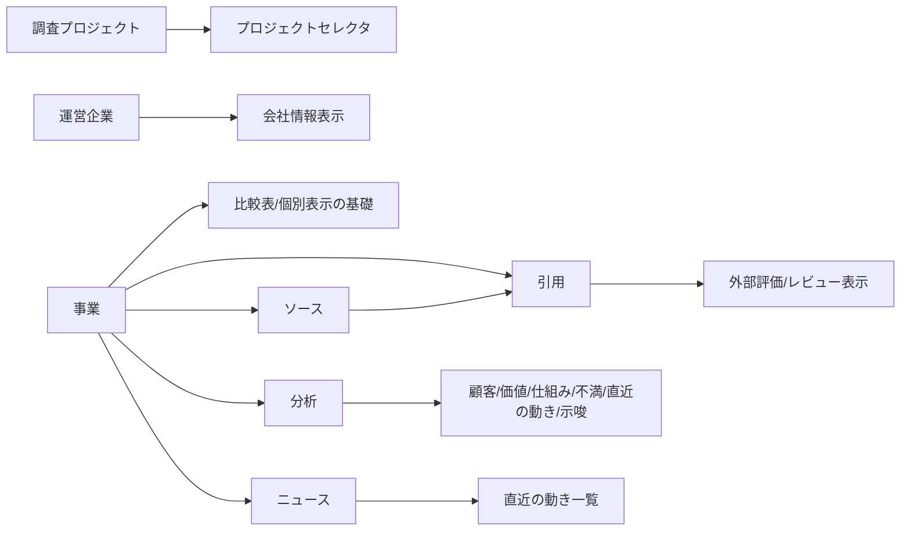

# Business Research スプレッドシート構造（現状可視化）

対象実装:
- `plugins/business-research/scripts/setup_dashboard.gs`
- `plugins/business-research/scripts/dashboard.html`

## 1) 現在のデータモデル（ER）

```mermaid
erDiagram
  調査プロジェクト {
    string プロジェクトID PK
    string プロジェクト名
    string 調査目的
    string カテゴリ
    string 調査対象事業ID FK
    string ポジション軸X名
    string ポジション軸Y名
    datetime 作成日時
  }

  事業 {
    string 事業ID PK
    string プロジェクトID FK
    string 事業名
    string サービス名
    string 公式URL
    enum 事業種別
    string 運営企業ID FK
    string 価格帯
    number ポジションX値
    number ポジションY値
    text BMC_価値提案
    text BMC_顧客セグメント
    text BMC_チャネル
    text BMC_顧客との関係
    text BMC_収益の流れ
    text BMC_主要リソース
    text BMC_主要活動
    text BMC_主要パートナー
    text BMC_コスト構造
    text 主要KPI
    json 財務シミュレーション_JSON
    json 実績_JSON
    json BMC詳細_JSON
  }

  運営企業 {
    string 企業ID PK
    string 企業名
    string 企業URL
    string 規模感
  }

  ソース {
    string ソースID PK
    string 事業ID FK
    string URL
    string ページタイトル
    enum 種別
    string 観点
    datetime 取得日時
    string メモ
  }

  引用 {
    string 引用ID PK
    string ソースID FK
    string 事業ID FK
    text 引用テキスト
    enum 感情
    enum 観点
    string 顧客属性
    string 根拠区分
  }

  分析 {
    string 分析ID PK
    string プロジェクトID FK
    string 事業ID FK_nullable
    enum 観点
    text 結論
    json 証跡JSON
    string 確信度
    string 根拠区分
  }

  ニュース {
    string ニュースID PK
    string 事業ID FK
    string タイトル
    string URL
    date 日付
    enum 種別
    text 要点
  }

  ダッシュボード表示用 {
    string プロジェクトID
    string プロジェクト名
    string カテゴリ
    string 調査目的
    string 調査対象事業名
    number 競合事業数
    string 参照事業一覧
    datetime 最終更新日時
  }

  調査プロジェクト ||--o{ 事業 : プロジェクトID
  運営企業 ||--o{ 事業 : 運営企業ID
  事業 ||--o{ ソース : 事業ID
  事業 ||--o{ 引用 : 事業ID
  ソース ||--o{ 引用 : ソースID
  事業 ||--o{ 分析 : 事業ID
  調査プロジェクト ||--o{ 分析 : プロジェクトID
  事業 ||--o{ ニュース : 事業ID
  調査プロジェクト ||--o{ ダッシュボード表示用 : 集約出力
```

## 2) リレーションの実装上の意味

- `調査プロジェクト -> 事業`: 1:N（1プロジェクトに複数事業。`事業種別=調査対象` が主対象）
- `事業 -> 運営企業`: N:1（複数事業が同一企業を参照可能）
- `事業 -> ソース -> 引用`: 1:N:N（根拠トレースの主経路）
- `事業 -> 分析`: 1:N（観点ごとの結論）
- `調査プロジェクト -> 分析(事業ID空)`: 横断示唆（`crossAnalyses`）
- `事業 -> ニュース`: 1:N（時系列変化）
- `ダッシュボード表示用`: `調査プロジェクト` + `事業` を集約したマテリアライズドビュー

## 3) ダッシュボード表示へのマッピング



## 4) 現状モデルの特徴（認知負荷の観点）

- 強み
- `project -> business -> evidence` の系譜が明確で、監査しやすい。
- ダッシュボードは `getResearchData(projectId)` で1オブジェクトに統合され、UI実装は単純。

- 認知的に重い点
- `事業` に BMC・財務・実績・詳細JSON が同居し、1行の意味が広すぎる。
- `引用` が `事業ID` と `ソースID` の二重参照で、入力時に迷いやすい。
- `分析` が「事業別」と「横断（事業ID空）」を同一テーブルで扱い、用途境界が曖昧。

## 5) 人間の認知に寄せる改善方向（次段階の案）

1. ストーリー単位に層分離する
- レイヤーA: 事実（`ソース`,`引用`,`ニュース`）
- レイヤーB: 解釈（`分析`）
- レイヤーC: 意思決定（`示唆`,`勝ち筋`）

2. `分析` を2テーブルに分割する
- `事業分析`（必ず`事業ID`あり）
- `プロジェクト横断分析`（`プロジェクトID`のみ）

3. `事業` から巨大JSONを分離する
- `事業BMC詳細`（1:1）
- `事業財務`（1:1 or 1:N時系列）
- `事業実績`（1:N）

4. ダッシュボード向け読み取りモデルを固定化する
- 書き込み用正規化テーブルとは別に、`DashboardView` 相当シートを用途別（比較/個別/時系列）で分ける。

## 6) 実装時の整合ルール（現行コード準拠）

- 必須ID重複チェック: 全テーブルID列
- 参照整合:
- `事業.プロジェクトID -> 調査プロジェクト.プロジェクトID`
- `事業.運営企業ID -> 運営企業.企業ID`
- `ソース.事業ID -> 事業.事業ID`
- `引用.事業ID -> 事業.事業ID`
- `引用.ソースID -> ソース.ソースID`
- `分析.プロジェクトID -> 調査プロジェクト.プロジェクトID`
- `分析.事業ID -> 事業.事業ID`（空なら横断扱い）
- `ニュース.事業ID -> 事業.事業ID`

